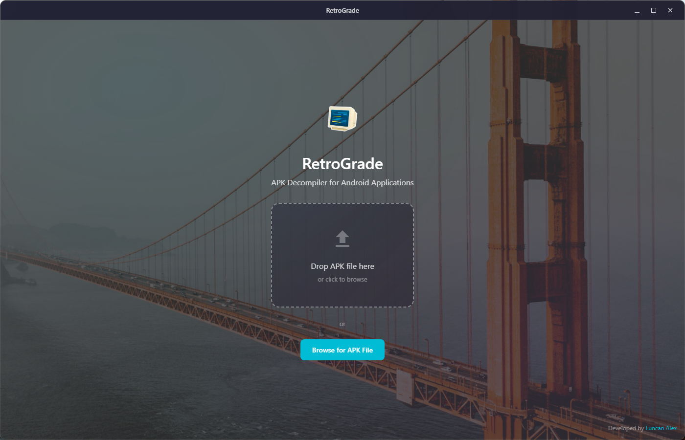

# RetroGrade

**APK Decompiler for Android Applications**

RetroGrade is a powerful, cross-platform desktop application for decompiling Android APK files. It converts Dalvik bytecode back to readable Java/Kotlin source code and extracts all resources, making it easy to analyze and understand Android applications.



## Features

- **Drag-and-Drop Interface**: Simply drag an APK file to start decompilation
- **Full Source Code Recovery**: Converts DEX files to readable Java/Kotlin code
- **Resource Extraction**: Decodes XML resources, layouts, strings, and assets
- **Modern Code Editor**: Built-in Monaco editor with Java/Kotlin syntax highlighting
- **File Explorer**: Navigate decompiled code with a familiar tree structure
- **Search Functionality**: Find code across all decompiled files instantly
- **Android Studio Export**: Build ready-to-open Android Studio projects with proper Gradle configuration
- **Dart Recovery Assistant**: Analyze Flutter/Dart apps with type inference, pattern matching, and code generation
- **Glassmorphism UI**: Beautiful Windows Aero-style transparency with frosted glass effects
- **Cross-Platform**: Runs on Windows 11 and macOS
- **Standalone**: Includes bundled Java Runtime - no additional installations required

## Installation

### Windows

1. Download `RetroGrade Setup 1.0.0.exe` from the [Releases](https://github.com/alex-luncan/RetroGrade/releases) page
2. Run the installer and follow the prompts
3. Launch RetroGrade from the Start menu

Alternatively, download the portable version `RetroGrade 1.0.0.exe` that runs without installation.

### macOS

1. Download `RetroGrade-1.0.0.dmg` from the [Releases](https://github.com/alex-luncan/RetroGrade/releases) page
2. Open the DMG and drag RetroGrade to your Applications folder
3. Launch from Applications

### Building from Source

```bash
# Clone the repository
git clone https://github.com/alex-luncan/RetroGrade.git
cd RetroGrade

# Install dependencies
npm install

# Build and run in development
npm start

# Build distributable
npm run dist:win    # Windows
npm run dist:mac    # macOS
```

**Note:** Building from source requires [Git LFS](https://git-lfs.github.com/) to download the bundled jadx and JRE files.

## Usage

### Basic Workflow

1. **Open APK**: Drag an APK file onto the application window, or click "Browse for APK File"
2. **Wait for Decompilation**: Progress is shown during extraction and decompilation
3. **Explore Code**: Use the file explorer on the left to navigate the decompiled structure
4. **View Files**: Click on any file to view its contents in the code editor
5. **Search**: Use the search panel to find specific code across all files
6. **Build Project**: Click "Build Android Studio Project" to create a ready-to-open AS project

### Android Studio Integration

RetroGrade can generate fully configured Android Studio projects:
- Automatically parses `AndroidManifest.xml` for package name, SDK versions, and app name
- Detects Flutter apps and adds appropriate dependencies
- Copies native libraries (.so files) to jniLibs folders
- Generates proper `build.gradle` with detected features (Maps, Firebase, Room, etc.)
- Opens Android Studio automatically when project is ready

## Technology Stack

- **Framework**: Electron 33
- **Frontend**: React 18 + TypeScript
- **Code Editor**: Monaco Editor (VS Code engine)
- **State Management**: Zustand
- **Decompilation**: jadx (bundled)
- **Java Runtime**: Eclipse Temurin JRE 17 (bundled)
- **Build**: electron-builder

## Project Structure

```
retrograde/
├── src/
│   ├── main/                # Electron main process
│   │   ├── main.ts          # Application entry point
│   │   ├── preload.ts       # Secure bridge to renderer
│   │   ├── decompiler.ts    # APK decompilation logic
│   │   ├── axmlParser.ts    # Android binary XML parser
│   │   ├── androidStudioBuilder.ts  # AS project generator
│   │   └── dartRecovery/    # Dart Recovery Assistant Library
│   │       ├── index.ts     # Main entry point
│   │       ├── types.ts     # Type definitions
│   │       ├── typeInference.ts    # Type inference engine
│   │       ├── patternMatcher.ts   # Flutter pattern detection
│   │       ├── symbolRecovery.ts   # Symbol extraction
│   │       ├── pseudoCParser.ts    # Ghidra output parser
│   │       ├── dartGenerator.ts    # Dart code generation
│   │       └── flutterPatterns.ts  # Flutter framework patterns
│   └── renderer/            # React frontend
│       ├── components/      # UI components
│       ├── store/           # Zustand state management
│       ├── styles/          # CSS styles
│       └── icons/           # SVG icon components
├── jadx/                    # Bundled jadx decompiler
├── jre/                     # Bundled Java Runtime Environment
├── build/                   # Build output
└── assets/                  # Application icons
```

## Contributing

Contributions are welcome! Please feel free to submit a Pull Request.

1. Fork the repository
2. Create your feature branch (`git checkout -b feature/AmazingFeature`)
3. Commit your changes (`git commit -m 'Add some AmazingFeature'`)
4. Push to the branch (`git push origin feature/AmazingFeature`)
5. Open a Pull Request

## License

This project is licensed under the MIT License - see the [LICENSE](LICENSE) file for details.

### Third-Party Licenses

RetroGrade bundles the following open-source components:

- **[jadx](https://github.com/skylot/jadx)** - Dex to Java decompiler by skylot (Apache License 2.0)
- **[Eclipse Temurin](https://adoptium.net/)** - Java Runtime Environment (GPLv2 with Classpath Exception)
- **[Monaco Editor](https://microsoft.github.io/monaco-editor/)** - Code editor by Microsoft (MIT License)
- **[Electron](https://www.electronjs.org/)** - Desktop application framework (MIT License)

## Credits

**Developer**: [Luncan Alex](https://luncanalex.dev/)

---

Made with dedication by [Luncan Alex](https://luncanalex.dev/)
